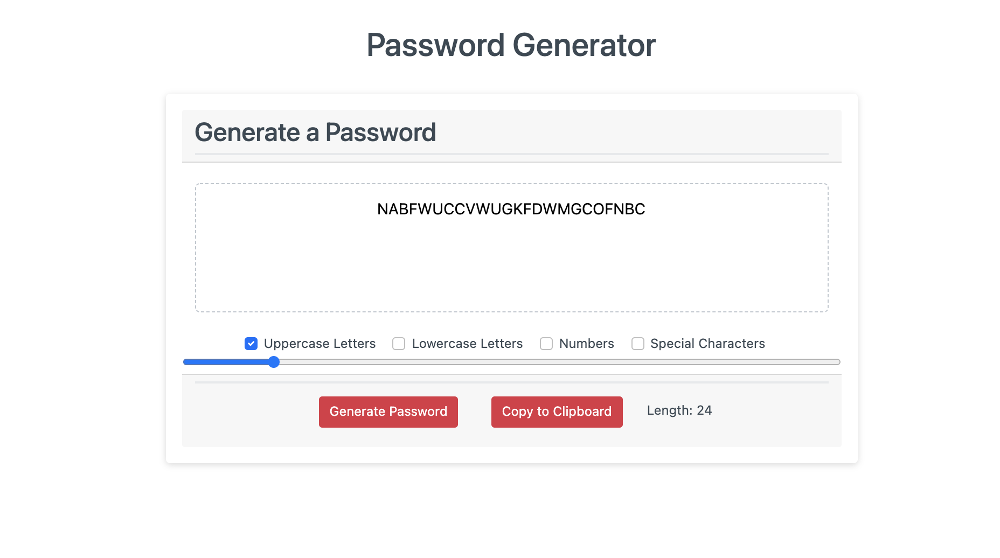

# Password Generator:
This tool is used to generate random passwords between 8 and 128 characters.

# How to Use:
Select one or more checkboxes for Uppercase, Lowercase, Numbers, or Special Characters. Use the slide bar to select the password length. Copy to Clipboard can be used to easily copy the password

## Deployed Application Link

[https://hannamunoz.github.io/password-generator/](https://hannamunoz.github.io/password-generator/)